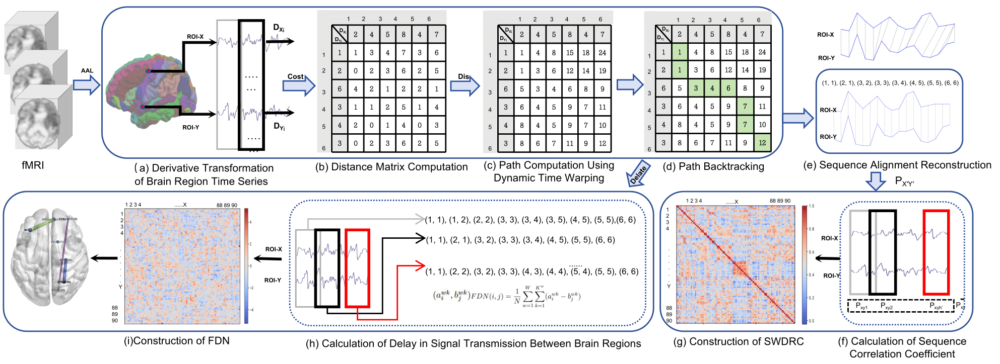

# Alzheimer’s Disease Diagnosis Based on Derivative Dynamic Time Warping Functional Connectivity Networks
Given the differences in signal transmission delays across brain regions between patients and healthy individuals, based on Derivative Regularity (CDR) algorithm, we constructed the dynamic functional connectivity network: Slide Window based
on the Derivative Regularity Correlation (SWDRC) and the Functional Delay Network (FDN) to enhance the detection and analysis of Alzheimer's Disease.

The innovation of this paper lies in the development of the SWDRC method, which effectively captures the asynchronous and dynamic characteristics of brain region activities by using the Correlation based on Derivative Regularity (CDR) algorithm to compute the optimal match for time series synchronization between two brain regions. Additionally, the construction of the Functional Delay Network (FDN), which accounts for the dynamic delays in signal transmission between brain regions, not only improves classification accuracy but also emphasizes the importance of incorporating metrizable delays in neurodegenerative disease research. These innovations demonstrate the potential of our methods in more accurately understanding and diagnosing neurodegenerative conditions.

Official Repository of the paper: [Alzheimer’s Disease Diagnosis Based on Derivative Dynamic Time Warping Functional Connectivity Networks](https://github.com/hxpotato/SWDRC)
## Method
The study proposes three interconnected core techniques to address limitations of traditional functional connectivity analysis:
1. **CDR (Correlation based on Derivative Regularity)**: Alters time series features before similarity evaluation, uncovering lagged interactions overlooked by conventional methods. It aligns first-order signal derivatives via Dynamic Time Warping (DTW) to emphasize shape similarity and minimize temporal distortion.
2. **SWDRC (Sliding Window based on Derivative Regularity Correlation)**: Uses CDR in a sliding window format to align signal dynamics, capturing subtle spatio-temporal changes in neural regulation.
3. **FDN (Functional Delay Network)**: Measures relative transmission delays between brain regions, clarifying temporal patterns of signal propagation and quantifying interregional time offsets.
   
<p >
  
    <figcaption style="font-size:10px;">The Workflow of the System : Constructing CDR: (a) After preprocessing the rs-fMRI data, time series for each ROI are extracted using the AAL template and smoothed. A sliding window is then applied to segment the time series into subsequences, from which derivatives are computed; (b) The distance matrix within the subsequences is calculated; (c) The optimal path distance is computed based on the distance matrix; (d) Path backtracking is performed based on the optimal distance value to obtain the best sequence alignment. Constructing SWDRC: (e) The original sequence is reconstructed according to the alignment results; (f) The PCC of the reconstructed subsequences within each window is computed, and the mean PCC across all windows is used as the functional connectivity coefficient; (g) Functional connectivity coefficients for all ROI pairs are then calculated to build the functional connectivity network. Constructing FDN: (h) The optimal path for each sub-window is recorded, and the corresponding relative delay coefficients are estimated;(i) Delay coefficients for each pair of ROI are then aggregated to construct the FDN.</figcaption>
 </figcaption>
</p>


## Dataset
Two public datasets were used for experiments:

### ADNI Dataset
- 417 subjects: 165 Healthy Controls (HC), 108 Alzheimer’s Disease (AD) patients, 144 Mild Cognitive Impairment (MCI) individuals.
- Mean age: AD (75.11±5.92), HC (74.88±7.65), MCI (72.26±7.30).
- Imaging parameters: 3.0T MRI scanner, EPI sequences, 140 time points, TE=30ms, TR=3000ms, 48 slices, spatial resolution=3.31×3.31×3.31mm³, FA=80°.
- ADNI official website: http://adni.loni.usc.edu
  
### ABIDE Dataset
- Data from two largest sites (NYU, UM): 116 Autism Spectrum Disorder (ASD) patients, 156 HC.
- Mean age: ASD (14.51±5.81), HC (15.48±5.42).
- Standardized preprocessing including head motion correction, temporal smoothing, spatial normalization, and denoising.
- ABIDE official website:https://fcon_1000.projects.nitrc.org/indi/abide/

### Data Preprocessing
Performed using MATLAB-based RESTplus toolkit:
1. Removal of first 5 time points.
2. Slice-timing correction and head motion correction (excluding data with translations >2mm or rotations >2°).
3. Spatial normalization to EPI template.
4. Regression of nuisance covariates (6 head motion parameters, white matter signals, cerebrospinal fluid signals, global brain signals).
5. Smoothing with 6mm Gaussian kernel and band-pass filtering (0.01–0.08Hz).
6. Parcellation into 90 ROIs using AAL template and extraction of mean time series.

## Code Structure
```
.
├── configs                   # Experiment configuration files
├── data                      # Dataset storage and preprocessing scripts
│   ├── adni_preprocess.py    # ADNI dataset preprocessing
│   ├── abide_preprocess.py   # ABIDE dataset preprocessing
│   └── utils.py              # Data utility functions
├── models                    # Model definitions
│   ├── cdr.py                # CDR algorithm implementation
│   ├── swdrc.py              # SWDRC network construction
│   ├── fdn.py                # FDN network construction
│   └── utils.py              # Model utility functions
├── experiments               # Experiment scripts
│   ├── classification.py     # Classification task implementation
│   ├── network_analysis.py   # Network property analysis
│   └── hyperparameter_search.py # Grid search for optimal parameters
├── utils                     # Shared utilities
│   ├── metrics.py            # Evaluation metrics (ACC, AUC, sensitivity, specificity)
│   ├── visualization.py      # Result visualization tools
│   └── tools.py              # General helper functions
├── main.py                   # Main entry point for running experiments
└── requirements.txt          # Dependencies
```

## Key Experimental Results
### Hyperparameter Optimization
- Optimal sliding window size: 10, step size: 4 (minimized mean p-value of top 1% functional connections).

### Network Properties
- **Small-World Coefficient**: SWDRC network shows stronger small-world characteristics than comparative methods (SFCN, FCN-SW, DCC, etc.) across sparsity 0.1–0.4.
- **Clustering Coefficient**: SWDRC achieves higher clustering coefficients at all sparsity levels, capturing modular structure of brain functions.

### Classification Performance
| Task | Method | Accuracy (%) | AUC (%) |
|------|--------|--------------|---------|
| HC vs. AD (ADNI) | SWDRC+FDN | 90.39±0.65 | 96.31±0.61 |
| HC vs. MCI (ADNI) | SWDRC+FDN | 84.99±0.66 | 88.43±0.73 |
| HC vs. MCI vs. AD (ADNI) | SWDRC+FDN | 86.49±0.62 | 91.12±0.48 |
| HC vs. ASD (ABIDE) | SWDRC+FDN | 92.47±0.58 | 96.91±0.52 |

### FDN Analysis
- Network delay increases from HC → MCI → AD, with significant differences in key brain regions (lenticular nucleus, supplementary motor area, superior occipital gyrus).
- Critical delayed connections: Posterior cingulate cortex-angular gyrus (AD vs. HC), orbitofrontal cortex-temporal pole (MCI vs. HC).

## Launching Experiments
### Environment
```
conda create -n ad_diagnosis python=3.8
pip install -r requirements.txt
```

### Run Classification Experiments
```
python main.py \
  --task classification \
  --dataset adni \
  --model swdrc+fdn \
  --window_size 10 \
  --step_size 4 \
  --classifier svm
```

### Run Network Analysis
```
python main.py \
  --task network_analysis \
  --dataset adni \
  --model swdrc \
  --sparsity 0.2
```

## Acknowledgement
This work is supported by:
- Scientific Research Start-up Fund Project for High-level Researchers of Huaqiao University (Grant 22BS105)
- Scientific and Technological Major Special Project of Fujian Provincial Health Commission (Grants 2023Y9376, 2021ZD01004)
- Natural Science Foundation of Fujian Province, China (Grant 2022J01318)

## Citation
If you find this repository useful in your research, please consider giving a star :star: and a citation
```
@article{hong2025alzheimer,
  title={Alzheimer's Disease Diagnosis Based on Derivative Dynamic Time Warping Functional Connectivity Networks},
  author={Hong, Xin and Lin, Yongze and Wu, Zhenghao},
  journal={IEEE Transactions on Medical Imaging},
  year={2025},
  publisher={IEEE}
}
```


